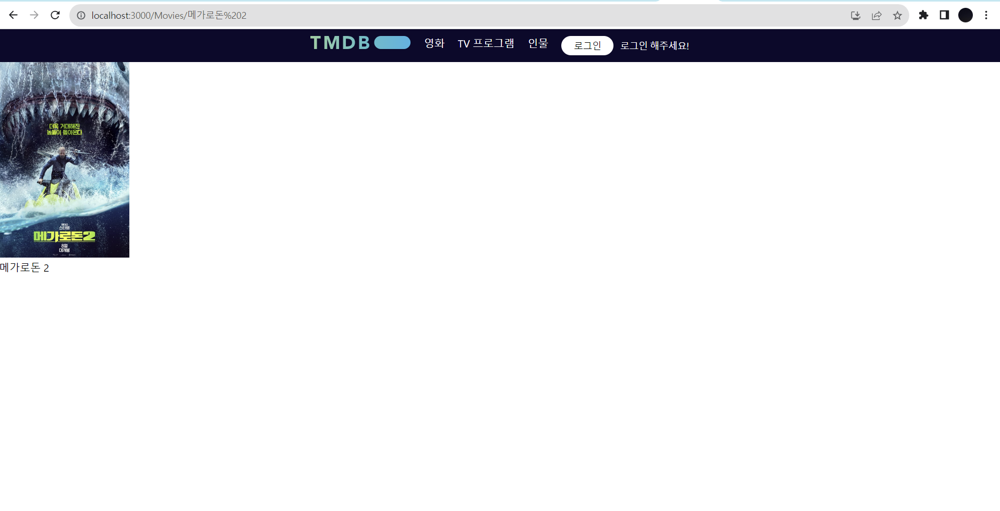

5주차 실습 화면 구현

- conditional Rendering  
  -Ad.jsx, AdPage.jsx  
  -LoginControl.jsx   
- Routing
  -App.js  
  -Celebirity.jsx 
  -Home.jsx 
  -TV.jsx 
  -Movie.jsx 
  

6주차 실습 화면 구현  

- 실습 
  : 영화 컴포넌트를 누르면 그 영화의 상세페이지로 넘어가기
  -useNavigate Hook  
  -useParams, useLocation  
  -App.js  
  -Movies.jsx  
  -MoviesDetail.jsx  
    

- 미션1  
  : 5주차 미션으로 구현했던 로그인 상태 관리 -> Hook 사용하기  
  -useState  
  -LoginControl2.jsx 

- 미션2  
  : 잘못된 주소를 입력했을 때 NotFound.jsx가 뜨게 하고, 메인 페이지로 돌아갈 수 있는 기능 추가.
  -NotFound.jsx 
  
